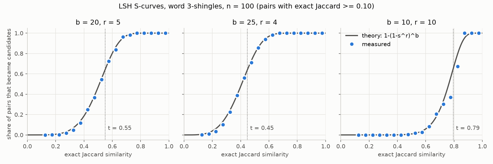

# Week 4: Finding Similar Items

## Objectives

- Study MMDS Chapter 3: Jaccard similarity (3.1), shingling (3.2), minhash
  signatures (3.3), and locality-sensitive hashing by banding (3.4).
- Write sample scripts for shingling, minhash, and LSH.
- Apply them to a real dataset and check the results against exact answers.
- Run the LSH step on the Hadoop cluster and record runtime.

New to the topic? Start with the [hand-worked walkthrough](docs/minhash-lsh-walkthrough.md),
which follows four tiny documents through every step.

## Dataset

We reused the three Apollo 11 transcripts from Week 2 (2.2 MB, already in HDFS;
nothing was downloaded again). NASA's public-affairs commentary often replays
air-to-ground exchanges for the press, so the same passage appears in two files
with small differences. That makes real near-duplicates to find.

Each file was split into **50-word windows starting every 25 words**, giving
14,201 windows from 355,040 words. Stride 25 keeps any long, exactly replayed
passage at Jaccard 0.60 or higher for its best-aligned pair of windows. Stride
50 could drop it to 0.32. [The dataset notes](docs/dataset.md) give the math,
the stride comparison, and the coverage it costs.

Overlapping windows from the same file share words by construction. They are
excluded from every number below.

## Implementation

All code is Python standard library only.

| Step | File | What it does |
| --- | --- | --- |
| Shingling | [shingle.py](scripts/shingle.py) | Week 2 word rules, word or character k-shingles, crc32 hash to 32 bits |
| Minhash | [minhash.py](scripts/minhash.py) | n = 100 rows of h(x) = (a*x + b) mod (2^61 - 1), seeded; exact and estimated Jaccard |
| LSH | [lsh.py](scripts/lsh.py) | b bands of r rows, SHA-1 bucket keys, candidate pairs, threshold (1/b)^(1/r) |
| Experiment | [find_similar.py](scripts/find_similar.py) | Windows, ground truth, evaluation, top pairs |
| Chart | [plot_scurve.py](scripts/plot_scurve.py) | S-curve PNG, or a table without matplotlib |
| Hadoop | [scripts/hadoop/](scripts/hadoop/) | Banding job, dedupe job, launcher |

Shingle hashes use crc32, never Python's built-in `hash()`. That function is
salted per process, so two Hadoop tasks would hash the same shingle
differently.

**Ground truth.** An inverted index lists the windows that contain each
shingle. Walking it gives the exact Jaccard similarity of every pair that
shares at least one shingle: 7,297,737 pairs for word 3-shingles. Every other
pair has Jaccard 0. So the ground truth is exact, not sampled, and still takes
only 3.3 seconds.

## Results

### Minhash estimate error

Word 3-shingles, n = 100, on all 175,375 pairs with exact Jaccard 0.10 or more:

| Measure | Value |
| --- | ---: |
| Mean absolute error | 0.027 |
| Root-mean-square error | 0.034 |
| 1/sqrt(n) | 0.100 |
| Pairs with error within 1/sqrt(n) | 99.6% |

1/sqrt(n) is a loose upper bound. The exact standard deviation is
sqrt(J(1-J)/n), which is largest (0.05) at J = 0.5. Measured error tracks it:

| Exact Jaccard | Pairs | RMSE | sqrt(J(1-J)/n) at bin middle |
| --- | ---: | ---: | ---: |
| 0.1-0.2 | 151,923 | 0.033 | 0.036 |
| 0.3-0.4 | 3,754 | 0.045 | 0.048 |
| 0.5-0.6 | 874 | 0.049 | 0.050 |
| 0.7-0.8 | 154 | 0.048 | 0.043 |
| 0.9-1.0 | 45 | 0.016 | 0.022 |

The average error is not zero for one fixed seed: it was +0.015 on
low-similarity pairs with seed 4099. Repeating with other seeds gave values
from -0.024 to +0.015, so the sign flips. These are shared errors from reusing
one set of 100 hash functions across pairs that contain the same common
shingles. They are not a bias in the method.

### LSH settings tried

Near-duplicate means exact Jaccard 0.5 or more. Cross-file pairs only (1,410
true pairs for k = 3, 630 for k = 5). "Checked" keeps candidates whose
signatures agree on at least half their rows.

| k | b, r | Threshold | Candidates | Recall | Precision | Checked recall | Checked precision |
| -: | --- | -: | -: | -: | -: | -: | -: |
| 3 | 20, 5 | 0.55 | 1,776 | 0.741 | 0.588 | 0.697 | 0.878 |
| **3** | **25, 4** | **0.45** | **3,346** | **0.930** | **0.392** | **0.829** | **0.852** |
| 3 | 10, 10 | 0.79 | 188 | 0.132 | 0.989 | 0.131 | 0.995 |
| 5 | 20, 5 | 0.55 | 901 | 0.773 | 0.541 | 0.724 | 0.865 |
| 5 | 25, 4 | 0.45 | 1,830 | 0.932 | 0.321 | 0.837 | 0.805 |
| 5 | 10, 10 | 0.79 | 105 | 0.165 | 0.991 | 0.165 | 0.991 |

**Final choice: word 3-shingles, b = 25, r = 4.**

- Its threshold, 0.45, sits a little below our 0.5 target. MMDS recommends
  that when missing a true pair costs more than checking an extra one. Here it
  finds 93% of true pairs; b = 20, r = 5 finds only 74%.
- Its low raw precision is cheap to fix. Checking 3,346 candidates against
  their exact Jaccard takes milliseconds, which gives precision 1.0 with
  recall still 0.93. That is still far fewer than the 7.3 million pairs
  sharing a shingle, or the roughly 100 million pairs of all windows.
- k = 3 beats k = 5 on this data. One changed word breaks 5 shingles at k = 5
  but only 3 at k = 3. Replayed passages contain small transcription edits, so
  k = 5 rates them less similar, and only half as many cross-file pairs reach
  0.5 (630 versus 1,410).

We also tried character shingles (k = 5 and k = 9). Character 5-shingles are
so common in English that 100 million pairs share at least one. Character
9-shingles behaved like word 3-shingles (recall 0.93 at b = 25, r = 4) with
more work, so we kept words.

### Measured versus theoretical S-curve



For each bin of exact Jaccard, the dots show the fraction of pairs that became
candidates. The line is 1 - (1 - s^r)^b. They agree closely around each
threshold. For b = 10, r = 10 the measured points dip below the line between
0.70 and 0.85. Those bins hold only 38 to 116 pairs, and many come from
overlapping windows of the same replay, so they are not independent trials.

### Top near-duplicate pairs

All of the strongest matches pair the air-to-ground transcript with the
public-affairs commentary:

| Jaccard | Air-to-ground window | Commentary window | Excerpt |
| ---: | --- | --- | --- |
| 1.00 | 012925 | 024575 | "bernard lovell director of the observatory washington upi vice president spiro t agnew ..." |
| 1.00 | 127300 | 175850 | "and then lift vector down and then modulate the lift vector until g dot ..." |
| 0.96 | 103825 | 142025 | "baltimore is breezing toward the eastern division title they lead second place boston ..." |
| 0.96 | 005200 | 011850 | "area greenland was clear and it appeared to be we were seeing just the ..." |
| 0.92 | 067550 | 099475 | "the area we see some angular blocks out several hundred feet in front of ..." |

The baseball and news items are morning news that Mission Control read up to
the crew, which the commentary then replayed for the press. Only 15 of 1,410
cross-file near-duplicates involve the onboard-voice transcript, which makes
sense: the onboard recordings were not broadcast live.

## Hadoop Streaming version

Only the LSH step runs on Hadoop. Signatures are computed locally and uploaded,
one line per window: `window_id<TAB>v1 v2 ... v100`.

1. **Banding job.** The mapper emits `band:digest<TAB>window_id` for each of
   the 25 bands, using the same `lsh.py` as the local code. Three reducers
   each receive whole buckets and output every pair in buckets with two or
   more members.
2. **Dedupe job.** A pair that matches in several bands appears several times.
   A second job keys on both window IDs, so copies arrive together, and keeps
   one line per pair with the number of bands that agreed.

The reducer sorts each bucket's members before pairing. Hadoop groups values
by key but does not order them, which was the Week 3 lesson. A test feeds the
values in shuffled order.

Before submitting, we ran `yarn node -list` (3 nodes running) and
`hdfs dfsadmin -report` (no missing, corrupt, or under-replicated blocks).

**Result.** Hadoop produced 8,842 deduplicated pairs from 15,407 raw bucket
pairs. The sorted list is byte-for-byte identical to the local LSH candidates.

**Two failures, kept on record.**

- The first run failed in every map task. Hadoop's `-files` option places each
  script in its own cache directory and links it into the task directory.
  Python follows the link, so it looked for `lsh.py` in the mapper's cache
  directory and did not find it. Our tests had set `PYTHONPATH` themselves,
  which hid the problem. The launcher now sets `PYTHONPATH=.`, and a test
  rebuilds Hadoop's link layout.
- The second run gave the right pairs but an extra empty column. With a
  two-field key, Streaming hands the reducer a trailing empty value. The
  reducer now reads only the two IDs. The third run is the one reported here.

Each run used a new output path under `/results/apollo11/`; nothing was
overwritten.

## Runtime

| Step | Wall-clock time |
| --- | ---: |
| Local: whole experiment (two k values, three settings each, all evaluation) | 20.0 s |
| Local: minhash signatures, 14,201 windows | 6.1 s |
| Local: exact Jaccard of 7.3 million pairs | 3.3 s |
| Local: LSH banding, final setting | 0.4 s |
| Cluster: upload signatures to HDFS | 5.0 s |
| Cluster: banding job | 61.7 s |
| Cluster: dedupe job | 35.7 s |
| Cluster: both jobs | 101.9 s |

The banding job used only 11 s of CPU across all its tasks. The rest of its 62
seconds went to starting JVMs, asking YARN for containers, and shuffling. An
identical earlier run took 49.5 s and 55.2 s for the two jobs, so the timings
vary by 10 to 20 s per job. On 2.2 MB these numbers measure Hadoop's fixed
overhead, as in Week 3. They do not show how either approach scales.
[The example run log](docs/example-run-log.txt) has the full timing record.

## Limitations

- Ground truth uses the same 50-word windows. A replay shorter than a window,
  or split badly across windows, can be missed by both the exact check and
  LSH. Stride 10 found about 60% more replayed words, at 2.5 times the windows.
- Speaker labels, page headers, and OCR errors stay in the text.
- Signatures are computed locally; only banding runs on Hadoop.
- One seed and one dataset. Error and S-curve figures would tighten with more
  seeds.
- Small data: correctness evidence, not a performance benchmark.

## Avoiding AI slop

- Every script maps to a section of MMDS Chapter 3 or a stated assignment step.
- Exact Jaccard over every pair that shares a shingle is the oracle; no
  sampled or assumed ground truth.
- Hadoop output is compared byte-for-byte with the local LSH output.
- A suspicious minhash bias was tested across seeds before being explained.
- Both cluster failures and their causes are documented, not hidden.
- An overclaim in the stride rationale ("largest safe stride") was caught and
  corrected before publishing.
- Performance claims stop at what was measured on 2.2 MB.
- AI-assisted code was tested (22 Week 4 tests, under Python 3.14 and the
  cluster's 3.9) and must be understood before it is presented as course work.

## Reproduction

From the repository root:

```bash
python3 week-04/scripts/find_similar.py --output-dir data/week-04/local-run
python3 week-04/scripts/plot_scurve.py data/week-04/local-run/report.json \
  --output week-04/docs/s-curve.png
python3 week-04/scripts/lsh.py -b 25 -r 4
python3 -m unittest discover -s week-04/tests -v
```

On the controller as the `hadoop` account, with `lsh.py` copied next to the
Hadoop scripts:

```bash
bash run-hadoop.sh /hdfs/path/signatures.tsv /results/apollo11/NEW-RUN 25 4
```
